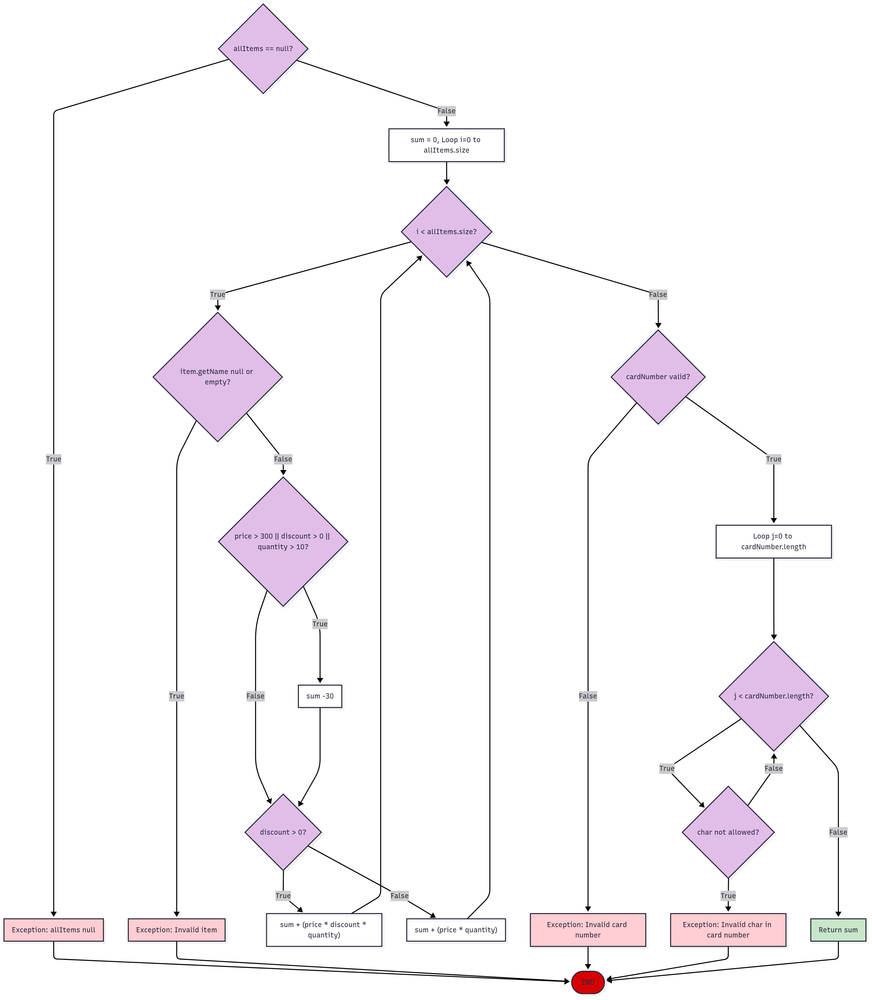

# Томе Ѓоргиев 233051

## Control Flow Graph

## Цикломатска комплексност
Користејќи ја формулата `V(G) = E − N + 2*P` каде 
E е бројот на рабови, N е бројот на јазли 
и P е бројот на поврзани компоненти, 
Добиваме:

`E = 26`  
`N = 19`  
`P = 1 (затоа што е една функција)`  
`V(G) = 26 - 19 + 2*1 = 7 + 2 = 9`

## Тест случаи според Every Statement критериумот
1. **Input:** `allItems = null, cardNumber = "1234567890123456"`  
   **Очекуван Output:** Да фрли RuntimeException со порака `"allItems list can't be null!"`  
   **Објаснување:** Ја опфаќа иницијалната проверка за null  

2. **Input:** `allItems = List.of(new Item(null, 1, 100, 0.0)), cardNumber = "1234567890123456"`  
   **Очекуван Output:** Да фрли RuntimeException со порака `"Invalid item!"`  
   **Објаснување:** Ја опфаќа проверката за валидност на името на Item

3. **Input:** `allItems = List.of(new Item("Item1", 1, 100, 0.0)), cardNumber = "123"`  
   **Очекуван Output:** Да фрли RuntimeException со порака `"Invalid card number!"`  
   **Објаснување:** Ја опфаќа проверката за валидност на должината на cardNumber

4. **Input:** `allItems = List.of(new Item("Item1", 1, 100, 0.0)), cardNumber = "123456789012345a"`  
   **Очекуван Output:** Да фрли RuntimeException со порака `"Invalid character in card number!"`  
   **Објаснување:** Ја опфаќа јамката за проверка на валидност карактерите на cardNumber

5. **Input:** `allItems = List.of(new Item("Item1", 5, 400, 0.2)), cardNumber = "1234567890123456""`  
   **Очекуван Output:** `1570.0`  
   **Објаснување:** Ја опфаќа пресметката за попуст и условот за `price > 300 `

6. **Input:** `allItems = List.of(new Item("Item1", 1, 100, 0.0)), cardNumber = "1234567890123456"`  
   **Очекуван Output:** `100.0`  
   **Објаснување:** Ја опфаќа пресметката на сумата без попуст

## Тест случаи според Multiple Condition критериумот  

За условот: `if (item.getPrice() > 300 || item.getDiscount() > 0 || item.getQuantity() > 10)`  
Ја добиваме следната табела на вистинитост:

|   | item.getPrice() > 300 | item.getDiscount() > 0 | item.getQuantity() > 10 |   |
|---|:---------------------:|:----------------------:|:-----------------------:|:-:|
| 1 |           T           |           X            |            X            | T |
| 2 |           F           |           T            |            X            | T |
| 3 |           F           |           F            |            T            | T |
| 4 |           F           |           F            |            F            | F |

Користејќи _"Lazy Evaluation"_, од типично потребните 8 (2^3) комбинации, бројот го намалуваме на само 4.  

##### 1. **TXX**
   **Input:**  `allItems = List.of(new Item("Item1",1,350,0.0)), cardNumber = "1234567890123456"`  
   **Очекуван Output:** `320.0`  
   **Објаснување:** Ако еден услов (пр. `item.getPrice() > 300`) е True, другите услови не се битни
#### 2. FTX
   **Input:**  `allItems = List.of(new Item("Item1",2,75,0.05), cardNumber = "1234567890123456"`  
   **Очекуван Output:** `320.0`  
   **Објаснување:** Ако еден услов (пр. `item.getPrice() > 300`) е False и друг (пр. `item.getDiscount() > 0`) е True, последниот услов не е битен
#### 3. FFT
   **Input:**  `allItems = List.of(new Item("Item1",12,20,0.0)), cardNumber = "1234567890123456"`  
   **Очекуван Output:** `320.0`  
   **Објаснување:** Ако два услови (пр. item.getPrice() > 300 и item.getDiscount() > 0) се False, а останатиот (пр. item.getQuantity() > 10) е True, тогаш целиот израз е True
#### 4. FFF
**Input:**  `allItems = List.of(new Item("Item1",3,5,0.0)), cardNumber = "1234567890123456"`  
**Очекуван Output:** `320.0`  
**Објаснување:** Само кога сите услови се False, целиот израз е False

